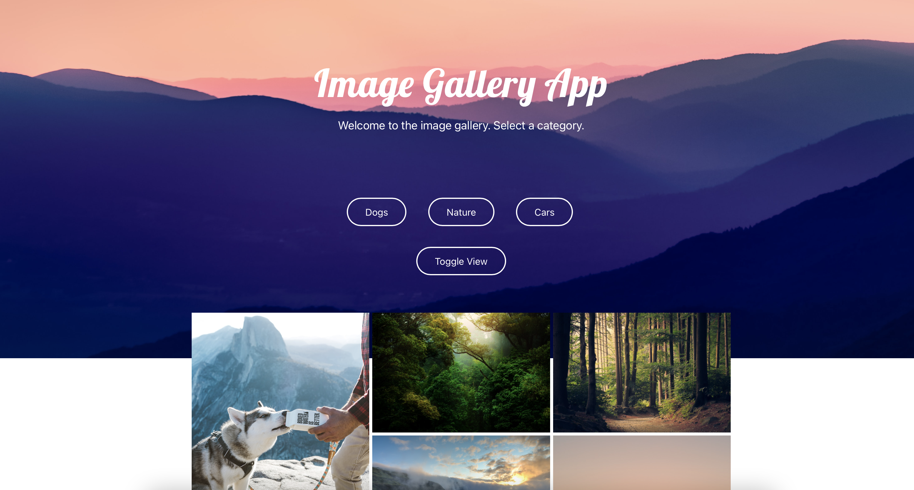

# Image Gallery Application

This application uses the Unsplash API and has the following features:

- Infinite scroll
- Category selector
- Toggle view
- Modal picture

Images loaded to start are the nature category. Click the different categories to see images related to each category.

If you click the toggle view button you can toggle between a grid view and list view.

Click on any image and see a modal popup of this image.

<a href="https://ln-image-gallery-js.netlify.app">App</a>

